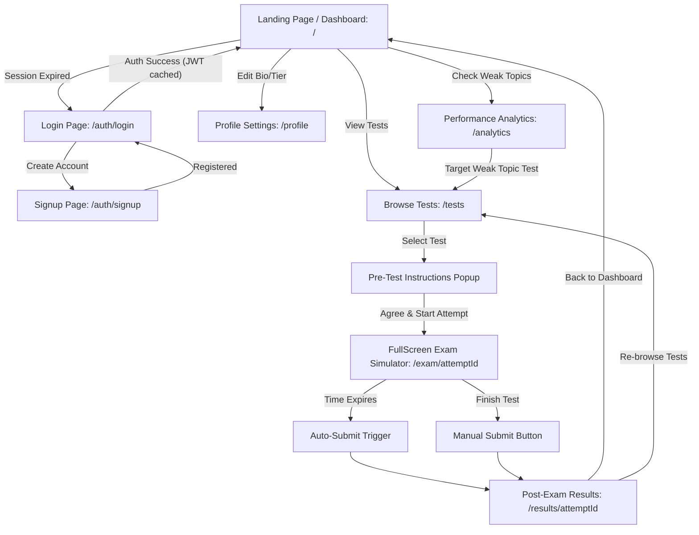
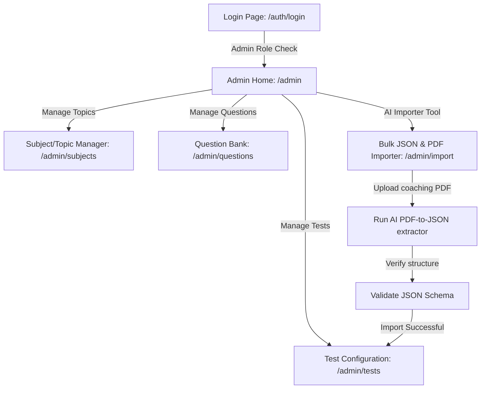

# PrepApp — App Flow & User Journey Map

This document outlines the user navigation flow, screens, state transitions, and journey pathways across the **PrepApp** application.

---

## 1. User Journeys (Mermaid Flowcharts)

### 1.1 Candidate Journey (Aspirant Flow)

This flowchart maps the typical flow of an exam taker practicing mock tests on the platform.

---

### 1.2 Administrator Journey (Manage Data Flow)

This flowchart maps how administrators manage mock tests, subjects, topics, and perform bulk imports.

---

## 2. Screen-by-Screen Navigation Details

### Screen 1: Dashboard (`/`)
*   **Purpose:** The central workspace for logged-in candidates. Shows user stats cards, accuracy progress meters, and navigation sidebars.
*   **User Action $\rightarrow$ Destination Page:**
    *   Click **"Start Practicing"** / **"Tests"** in Sidebar $\rightarrow$ Tests Screen (`/tests`).
    *   Click **"My Performance"** / **"Analytics"** in Sidebar $\rightarrow$ Analytics Screen (`/analytics`).
    *   Click **"My Profile"** Dropdown in Header $\rightarrow$ Profile Screen (`/profile`).
    *   Click **"Logout"** $\rightarrow$ Logs session out, clears token storage, redirects to Auth (`/auth/login`).

### Screen 2: Login / Signup (`/auth/login` & `/auth/signup`)
*   **Purpose:** Secure onboarding.
*   **User Action $\rightarrow$ Destination Page:**
    *   Successful credentials check $\rightarrow$ Redirects to Dashboard (`/`).
    *   Click **"Don't have an account? Sign up"** $\rightarrow$ Redirects to Signup (`/auth/signup`).
    *   Click **"Already registered? Log in"** $\rightarrow$ Redirects to Login (`/auth/login`).

### Screen 3: Test Explorer (`/tests`)
*   **Purpose:** Browse past year papers (PYQs) and mock tests. Users can filter tests by Category (All, Mock, PYQ) and search using a debounced search bar.
*   **User Action $\rightarrow$ Destination Page:**
    *   Click **"Start Test"** on any test card $\rightarrow$ Opens **Pre-Test Instructions modal**.
    *   Agree and launch inside the modal $\rightarrow$ Creates attempt, redirects to Exam Screen (`/exam/[attemptId]`).

### Screen 4: Full-Screen Live Exam (`/exam/[attemptId]`)
*   **Purpose:** Highly focused UPSC simulator environment. Disables global navigations, headers, and footers.
*   **Interface Options:**
    *   **Question Navigator Grid:** Color-coded numbers (Grey = Unvisited, Red = Unanswered, Green = Answered, Purple = Flagged for review). Click any number to jump to that question.
    *   **Action Panel:** Radio button selectors for options. Buttons for:
        *   *Submit Answer:* Saves response, marks green in grid.
        *   *Mark for Review:* Marks purple in grid (with or without selected option).
        *   *Clear Selection:* Deletes response from database, resets question status.
    *   **Timer Countdown:** Floating clock showing remaining duration.
*   **User Action $\rightarrow$ Destination Page:**
    *   Click **"Submit Test"** / Timer hits `0:00` $\rightarrow$ Triggers finish calculation, redirects to Results Screen (`/results/[attemptId]`).

### Screen 5: Post-Exam Review (`/results/[attemptId]`)
*   **Purpose:** Feedback sheet. Displays final score (UPSC marks), test duration, total correct/incorrect stats, and lists all questions showing selected answers, correct answers, and full explanations.
*   **User Action $\rightarrow$ Destination Page:**
    *   Click **"Back to Dashboard"** $\rightarrow$ Redirects to Dashboard (`/`).
    *   Click **"Browse Other Tests"** $\rightarrow$ Redirects to Test Explorer (`/tests`).

### Screen 6: Analytics (`/analytics`)
*   **Purpose:** Aggregated performance dashboard. Lists all subjects and topics, displaying an accuracy progress bar next to each, tagged with a status badge (**STRONG**, **MODERATE**, or **WEAK**).
*   **User Action $\rightarrow$ Destination Page:**
    *   Hover over weak points $\rightarrow$ Directs students on what topics they need to practice.

### Screen 7: Profile (`/profile`)
*   **Purpose:** Management of account fields.
*   **User Action $\rightarrow$ Destination Page:**
    *   Updates name, location, category (for UPSC age/marks criteria checks), member tier, and saves details.

---

## 3. Administrative Portal Flow

Only users authenticated with `role: "ADMIN"` are allowed access to the `/admin` path.

### Admin Dashboard (`/admin`)
*   **Purpose:** Admin stats overview (total tests, users registered, questions in bank). Gives cards directing to configuration subpages.

### Subject Manager (`/admin/subjects`)
*   **Purpose:** Add/remove subjects and nested child topics.

### Test Configurator (`/admin/tests`)
*   **Purpose:** Create mock tests, set duration, publish/unpublish tests, and link/unlink questions.

### Question Bank (`/admin/questions`)
*   **Purpose:** View all questions in the bank. Contains forms to add individual questions, configure options, mark correctness, and link to topics using dynamic combobox datalists.

### Bulk Importer (`/admin/import`)
*   **Purpose:** Seeding of question papers. Allows drag-and-drop of mock PDF papers to run AI coordinate extractions, pasting/validating raw JSON data, and converting alternate past year schemas into standard transactional formats.
